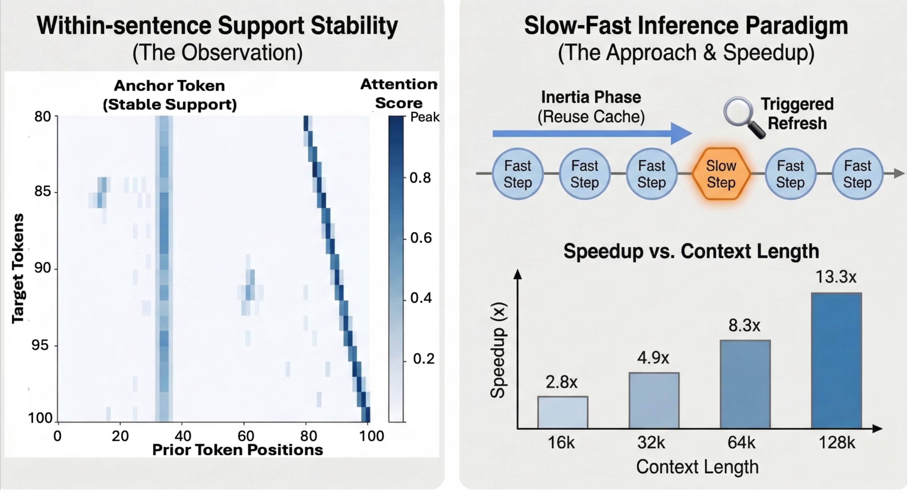
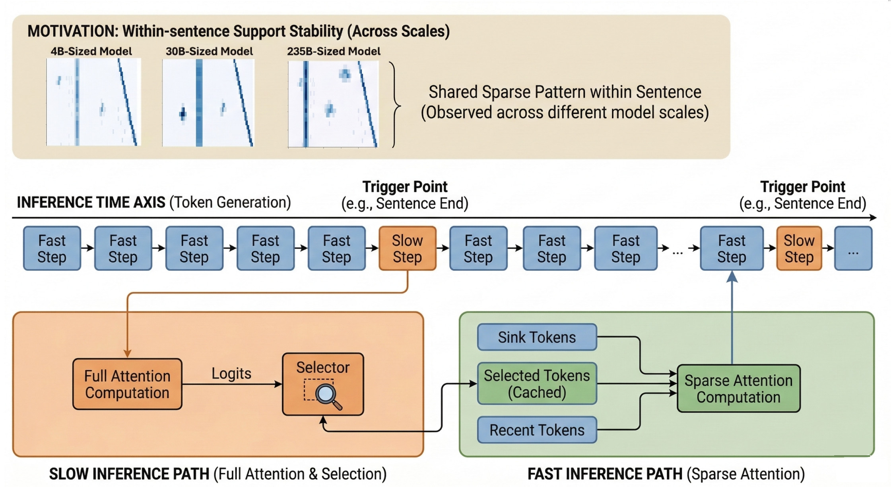
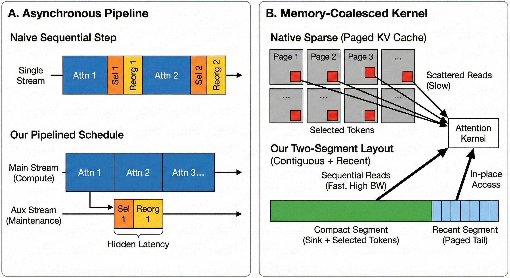
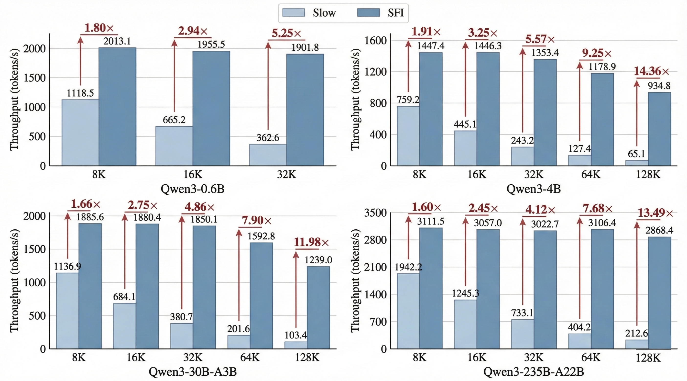

<div align="center">

<br>

# Slow-Fast Inference (SFI)

**Training-Free Inference Acceleration via Within-Sentence Support Stability**

**⚡ CUDA Release** &mdash; native FA3/FA4 sparse kernels&ensp;&middot;&ensp;full-CUDA-graph decode&ensp;&middot;&ensp;asynchronous sparse maintenance

<br>

<a href="https://arxiv.org/abs/2603.12038"></a>&nbsp;&nbsp;
<a href="LICENSE"></a>&nbsp;&nbsp;
<a href="https://github.com/vllm-project/vllm"></a>&nbsp;&nbsp;
<a href="https://github.com/vllm-project/flash-attention"></a>

<br><br>

<a href="#highlights">Highlights</a>&ensp;&middot;&ensp;
<a href="#method">Method</a>&ensp;&middot;&ensp;
<a href="#results">Results</a>&ensp;&middot;&ensp;
<a href="#installation">Installation</a>&ensp;&middot;&ensp;
<a href="#speed-benchmarking">Benchmarking</a>&ensp;&middot;&ensp;
<a href="#sparse-serving">Serving</a>&ensp;&middot;&ensp;
<a href="#longbench-v2-evaluation">LongBench</a>&ensp;&middot;&ensp;
<a href="#troubleshooting">Troubleshooting</a>&ensp;&middot;&ensp;
<a href="#citation">Citation</a>

<br><br>



<br><br>

**Up to 14.4&times; end-to-end decode speedup &mdash; training-free, applied to existing checkpoints.**

<br>

</div>

> [!NOTE]
> You are on **`cuda-kernel`**, the production branch of SFI. The paper's Triton reference implementation lives on [`triton-kernel`](https://github.com/LV-NUS/SFI/tree/triton-kernel); everything below is about deploying and validating the CUDA runtime.

## Highlights

- ⚡ **Sparse attention at native FlashAttention cost** &mdash; the fast step is not a bolt-on sparse backend. Mixed-page, dual-source attention (compact sparse pages + in-place recent tokens) is implemented *inside* FA3 (SM80/SM90) and FA4 CuTe (SM100): no Triton round-trip, no extra dispatch layer.
- 🎞️ **Full-CUDA-graph decode** &mdash; sparse decode steps replay as captured CUDA graphs, removing per-step launch overhead exactly where long-context decoding spends its time.
- 🔄 **Asynchronous sparse maintenance** &mdash; selection, refresh bookkeeping, and compact-page reorganization overlap the decode stream instead of blocking it.
- 🧩 **Zero-modification integration** &mdash; SFI attaches to vLLM v1 at process start through a patched FlashAttention clone and runtime hooks; your installed vLLM and flash-attention packages are never modified.
- 🖥️ **Three GPU generations, one setup** &mdash; `setup_flash_attention.sh --arch auto` detects SM80 / SM90 / SM100 and prepares the FA3 build or the FA4 CuTe JIT accordingly &mdash; and refuses a mismatched architecture rather than guessing.
- 🧪 **Fail-closed validation built in** &mdash; a one-shot correctness gate, a paired sparse/dense speed harness, and an official LongBench-v2 binding ship with the release. A silent dense fallback can never masquerade as a sparse result.

<br>

<div align="center">

| | [`triton-kernel`](https://github.com/LV-NUS/SFI/tree/triton-kernel) | **`cuda-kernel` &nbsp;(this branch)** |
|:--|:--|:--|
| Attention kernel | Triton sparse FlashAttention | native patched **FA3** (SM80/SM90) + **FA4 CuTe** (SM100) |
| Decode execution | eager kernel launches | **full CUDA Graph** capture &amp; replay |
| Serving | offline experiments | **OpenAI-compatible sparse server** + LongBench-v2 harness |
| Validation | throughput sweep scripts | **fail-closed** one-shot &middot; paired-speed &middot; quality gates |
| Best for | studying the method | **deployment and wall-clock speed** |

</div>

<br>

## Demo

<div align="center">

https://github.com/user-attachments/assets/2b4277f9-72ee-4ff2-bf4d-442bb58a1ba9

</div>

<br>

## Method

> *Do not pay the cost of full-history attention at every step when the model's useful support has not meaningfully changed.*

**Slow-Fast Inference (SFI)** exploits the observation that **attention support evolves more slowly than token generation**: within a sentence or short coherent span, the set of critical tokens tends to stay stable rather than change at every step. SFI therefore decouples decoding into two paths:

| | Fast Step | Slow Step |
|:---:|:---|:---|
| **What** | Attend to compact sparse memory | Run dense full attention |
| **When** | Most steps (cheap) | Sentence boundaries / refresh budget (occasional) |
| **Why** | Support hasn't changed | Time to refresh the sparse support |

<br>

<div align="center">

</div>

<br>

1. **Fast steps** &mdash; most steps attend only to a managed sparse state: **sink tokens** + **selected tokens** + **recent tokens**
2. **Slow steps** &mdash; at semantic boundaries or when a refresh budget is exhausted, a dense refresh step runs full attention
3. **Selector update** &mdash; dense-attention evidence from the slow step is converted, training-free, into sparse support for the next fast-step segment

Most decoding steps take the fast step; dense attention runs only at the moments support is likely to shift.

<details>
<summary>&ensp;<b>System design &mdash; inside the CUDA runtime</b></summary>

<br>

<div align="center">

</div>

<br>

- **Mixed-page dual-source kernel** &mdash; reusable long-range KV entries (sink + selected) are packed into compact 16-token pages, while recent tokens are read in place from the ordinary KV cache. A single patched FA3/FA4 kernel launch reads both sources.
- **Full-CUDA-graph decode** &mdash; the sparse fast step, including compact-page reads, is captured once and replayed as a CUDA graph on subsequent steps.
- **Asynchronous producer pipeline** &mdash; dense-attention evidence from slow steps feeds an alpha-fair selector; compact pages are rebuilt and published between decode steps, off the critical path. This pipeline is the "producer" referenced by the gates.
- **Per-architecture kernels** &mdash; SM80/SM90 use a compiled FA3 shared object (`_vllm_fa3_C*.so`); SM100 uses the patched FA4 CuTe sources with runtime JIT.

</details>

<details>
<summary>&ensp;<b>How SFI integrates into vLLM</b></summary>

<br>

SFI patches vLLM at runtime &mdash; no source modification required.

```
Python startup
     │
     ▼
┌──────────────────────────┐
│    sitecustomize.py      │  Auto-imported when the repo root is on PYTHONPATH
└───────────┬──────────────┘
            │
            ▼
┌──────────────────────────┐
│ patches/fa3_native/      │  Loads the architecture-matched patched
│ install.py               │  FlashAttention clone and bridges it into vLLM
└───────────┬──────────────┘
            │
            ▼
┌──────────────────────────┐
│ patches/                 │  Installs the sparse controller
│ patch_installer.py       │  and the v1 runner hooks
└───────────┬──────────────┘
            │
            ▼
┌──────────────────────────┐
│  VLLMSparseController    │  Routes every step: dense refresh
│                          │  or compact sparse attention
└──────────────────────────┘
```

Remove `VLLM_SPARSE_CONTROLLER_JSON` and no controller is installed; remove the patched FlashAttention root as well and the process runs as stock vLLM. The supplied runners configure the whole chain automatically &mdash; the full environment-variable contract lives under [Installation](#installation).

</details>

<br>

## Results

SFI achieves **1.6&ndash;14.4&times; end-to-end decode speedup** while **preserving quality close to dense full attention** across long-context and long-CoT workloads. The numbers below are the paper's algorithm-level results.

<details open>
<summary>&ensp;<b>End-to-end throughput</b></summary>

<br>

<div align="center">

</div>

<br>

Representative speedups at 128K context: &ensp; **Qwen3-4B** 14.36&times; &ensp;&middot;&ensp; **Qwen3-30B-A3B** 11.98&times; &ensp;&middot;&ensp; **Qwen3-235B-A22B** 13.49&times;

</details>

<details>
<summary>&ensp;<b>Kernel-level speedup</b>&ensp;<sub>KV length 16K &middot; batch=16 &middot; bf16</sub></summary>

<br>

| Retention (%) | 1.6 | 6.3 | 12.5 | 25.0 | 37.5 | 50.0 | 75.0 | 98.4 | 100 |
|:---:|:---:|:---:|:---:|:---:|:---:|:---:|:---:|:---:|:---:|
| **Speedup** | **10.67&times;** | **9.56&times;** | **7.15&times;** | **3.96&times;** | **2.75&times;** | **2.10&times;** | **1.43&times;** | 1.10&times; | 1.00&times; |

</details>

<details>
<summary>&ensp;<b>LongBench-v1 quality</b>&ensp;<sub>17 tasks &middot; 3 model scales</sub></summary>

<br>

| Category | Task | 4B Slow | 4B **SFI** | 30B-A3B Slow | 30B-A3B **SFI** | 235B-A22B Slow | 235B-A22B **SFI** |
|:---|:---|:---:|:---:|:---:|:---:|:---:|:---:|
| *Single-Doc QA* | Qasper | 40.60 | **44.20** | 38.96 | **42.14** | **45.77** | 44.67 |
| | MultiFieldQA-en | 46.56 | **49.31** | 50.32 | **53.22** | **51.21** | 50.92 |
| | MultiFieldQA-zh | 61.21 | **63.81** | 63.42 | **66.00** | **67.08** | 66.37 |
| *Multi-Doc QA* | HotpotQA | 55.34 | **59.00** | 61.68 | **63.37** | 67.13 | **67.65** |
| | 2WikiMQA | 42.02 | **44.50** | 54.68 | **55.98** | 64.14 | **65.31** |
| | MuSiQue | 24.79 | **25.76** | **32.22** | 31.95 | 42.86 | **43.44** |
| | DuReader | 21.85 | **23.77** | 21.40 | **23.44** | **25.38** | 24.58 |
| *Summarization* | GovReport | 27.87 | **29.72** | 29.40 | **30.18** | **31.68** | 31.28 |
| | QMSum | 22.11 | **22.21** | 21.66 | **21.92** | **22.81** | 22.72 |
| | MultiNews | **24.06** | 24.04 | **23.52** | 23.46 | **23.46** | 23.33 |
| *Few-Shot* | TREC | 73.00 | **75.00** | 77.50 | **78.50** | **77.50** | **77.50** |
| | TriviaQA | 85.29 | **85.62** | **91.56** | 91.06 | 91.86 | **92.10** |
| | SAMSum | 39.12 | **39.99** | 39.12 | **39.72** | 41.09 | **41.30** |
| | LSHT | 30.25 | **37.75** | 42.50 | **47.25** | 51.00 | **52.00** |
| *Synthetic & Code* | PassageRet-en | **100.0** | **100.0** | **100.0** | **100.0** | **100.0** | **100.0** |
| | LCC | **4.48** | 4.32 | 24.82 | **25.13** | **61.32** | 61.10 |
| | RepoBench-P | 5.17 | **5.28** | 24.76 | **24.92** | 62.56 | **63.18** |
| **Average** | | 41.40 | **43.19** | 46.91 | **48.13** | 54.52 | **54.56** |

SFI matches or improves full-KV decoding on most subsets, with the clearest average gains at 4B (+1.8) and 30B-A3B (+1.2).

</details>

<details>
<summary>&ensp;<b>LongBench-v2 quality</b></summary>

<br>

| Model | Method | Overall | Easy | Hard | Short | Medium | Long |
|:---|:---|:---:|:---:|:---:|:---:|:---:|:---:|
| Qwen3-4B | Slow | 34.2 | 37.5 | 32.2 | **35.0** | 33.5 | **34.3** |
| | **SFI** | **34.8** | **38.5** | **32.5** | **35.0** | **34.9** | **34.3** |
| Qwen3-30B-A3B | Slow | **35.1** | **36.0** | **34.6** | **38.5** | **32.8** | **28.6** |
| | **SFI** | **35.1** | **36.0** | **34.6** | **38.5** | **32.8** | **28.6** |
| Qwen3-235B-A22B | Slow | **46.0** | **50.0** | **43.7** | **48.0** | **44.1** | 47.6 |
| | **SFI** | **46.0** | **50.0** | **43.7** | 47.5 | **44.1** | **52.4** |

SFI remains stable across scales, with the strongest gain on the longest-context subset (+4.8 on Qwen3-235B-A22B).

</details>

<details>
<summary>&ensp;<b>Long-CoT reasoning</b>&ensp;<sub>GPQA &amp; MMLU</sub></summary>

<br>

| Model | GPQA Slow | GPQA **SFI** | MMLU Slow | MMLU **SFI** |
|:---|:---:|:---:|:---:|:---:|
| Qwen3-4B-Thinking | **64.14** | 63.70 | **63.00** | **63.00** |
| Qwen3-30B-A3B-Thinking | 69.70 | **71.21** | **70.90** | 70.60 |
| Qwen3-235B-A22B-Thinking | **80.80** | **80.80** | 90.09 | **90.30** |

SFI matches the full-KV baseline at medium and large scales, with only minor variation at 4B.

</details>

### Measure it on your hardware

This branch does not ask you to trust a table: one command runs three arms back-to-back on your GPU &mdash; the timed sparse arm, a dense reference timed under identical conditions with no profiling instrumentation attached (*observer-free*), and an instrumented sparse diagnostic arm that carries the sparse-route proof so the timed arms stay clean.

```bash
export PYTHON="/absolute/path/to/environment/bin/python"
export MODEL="/absolute/path/to/qwen3-model"

WITH_DENSE_REFERENCE=1 PYTHON="${PYTHON}" \
  bash scripts/run_speed.sh 0 "${MODEL}" bs8x12k sparse "pair_$(date +%Y%m%d_%H%M%S)"
# → must end with: SPARSE/DENSE LOCAL PAIRED COMPARISON OK
```

Read `decode_tps` (end-to-end decode window) and `all_decode_tps` (steady-state window after all prefills complete) for the sparse and dense arms from the printed summary. Details and rules: [Speed Benchmarking](#speed-benchmarking).

> [!NOTE]
> Paper numbers are algorithm-level results; end-to-end gains depend on model shape, context length, batch size, sparse retention, memory capacity, and GPU topology. For deployment claims, use the artifacts emitted by the paired benchmark on the target machine.

<br>

## Supported Hardware

| GPU class | Architecture | Kernel | Status |
|:--|:--:|:--|:--|
| NVIDIA A100-class | SM80 | patched FA3 (compiled `.so`) | ✅ **Validated** |
| NVIDIA H100/H800-class | SM90 | patched FA3 (compiled `.so`) | 🟡 **Build-verified** |
| NVIDIA B200-class | SM100 | FA4 CuTe (runtime JIT) | 📦 **Packaged** |

- **Validated** &mdash; end-to-end correctness, sparse-route proof, determinism, and throughput on SM80.
- **Build-verified** &mdash; patch application, compilation, and kernel-resource checks pass; run the local gates before use.
- **Packaged** &mdash; rebased overlay with a sequential FA3&rarr;FA4 patch proof; run the one-shot gate on target hardware.

SM90/SM100 graduate to performance-validated the moment the one-shot and paired gates pass on your Hopper/Blackwell machine &mdash; the same bar SM80 already cleared. The entrypoints select the correct kernel family automatically and refuse mismatched architectures.

<details>
<summary>&ensp;<b>Patch provenance</b></summary>

<br>

The public patch stack contains two generated release artifacts, checked against their canonical source trees:

| Patch | Applies to | Contents |
|:--|:--|:--|
| `kernel_patches/sfi_fa3_sm80_sm90.patch` | pinned vLLM FlashAttention upstream | shared wrapper + FA3 SM80/SM90 implementation |
| `kernel_patches/sfi_fa4_sm100_cute.patch` | applied after the FA3 patch | CuTe-only SM100 overlay |

`scripts/setup_flash_attention.sh` clones the pinned upstream, applies FA3 (SM80/SM90) or FA3&rarr;FA4 (SM100), initializes CUTLASS, and builds `vllm_flash_attn/_vllm_fa3_C*.so` for SM80/SM90 (SM100 keeps patched CuTe sources for runtime JIT). Every path emits `sfi_flash_attention_build_provenance.json`, which the runners validate before keying the helper-extension cache or starting JIT.

SFI does not modify the installed vLLM or flash-attention packages; the patched clone is loaded at process startup through `VLLM_SPARSE_FA3_UPSTREAM_ROOT`. Apply the patches through the setup script &mdash; do not hand-edit them or reconstruct them from another checkout.

</details>

<br>

## Installation

> [!TIP]
> **Prerequisites:** Python &ge; 3.10 &ensp;&middot;&ensp; CUDA-enabled PyTorch &ensp;&middot;&ensp; vLLM `0.19.x` (v1 engine) &ensp;&middot;&ensp; CUDA toolkit with `nvcc` &ensp;&middot;&ensp; `git` / `cmake` / `ninja` &ensp;&middot;&ensp; a Qwen3 instruction checkpoint (chat-template tokenizer)
>
> PyTorch, the CUDA toolkit, the driver, and the target GPU must be mutually compatible, and one absolute Python executable must own PyTorch, vLLM, the FA3 build or FA4 JIT, and all helper extensions. SFI patches vLLM v1 private interfaces, so stay on the supported vLLM line &mdash; incompatible drift fails at preflight rather than corrupting a run.

```bash
# 1) Clone the CUDA branch
git clone -b cuda-kernel https://github.com/LV-NUS/SFI.git
cd SFI

# 2) Bind one Python environment (absolute path) and sanity-check it
export PYTHON="/absolute/path/to/environment/bin/python"
export MODEL="/absolute/path/to/qwen3-model"
export GPU="0"
export PATH="$(dirname "${PYTHON}"):${PATH}"
"${PYTHON}" -c 'import torch, vllm; assert torch.cuda.is_available(); print(torch.__version__, torch.version.cuda, vllm.__version__, torch.cuda.get_device_capability(0))'
# → prints torch/CUDA/vLLM versions and a capability tuple: (8, 0), (9, 0), or (10, 0)

# 3) Prepare the architecture-matched kernel (auto-detects SM80 / SM90 / SM100)
PYTHON="${PYTHON}" NVCC_THREADS=4 MAX_JOBS=8 \
  bash scripts/setup_flash_attention.sh --arch auto --gpu "${GPU}"
# → success: sfi_flash_attention_build_provenance.json in the patched checkout
#            (+ vllm_flash_attn/_vllm_fa3_C*.so on SM80/SM90)
# note: the FA3 compile is by far the longest step; NVCC_THREADS / MAX_JOBS bound its parallelism

# (SM100 only) install the CuTe runtime BEFORE step 4 — see "SM100 (Blackwell) extras" below

# 4) Verify end to end: the one-shot correctness & route gate
RUN_ID="sfi_$(date +%Y%m%d_%H%M%S)"
PYTHON="${PYTHON}" TORCH_EXTENSIONS_DIR="${PWD}/tmp/torch_extensions/${RUN_ID}" MML=16384 \
  bash scripts/run_one_shot.sh "${GPU}" "${MODEL}" "oneshot_${RUN_ID}"
```

On memory-rich cards, `GPU_MEM_UTIL=0.75` may be supplied as a capacity-only
override; the fixed one-shot workload is unchanged and the effective value is
recorded in its artifacts.

The one-shot run must end with:

```text
child_returncode=0 gate_passed=True production_gate_passed=True producer_gate_passed=True route_proof_passed=True diagnostic_child_route_proof_passed=True decode_tps=...
ONE-SHOT PASS
```

If you see `ONE-SHOT PASS`, the installation is complete: output health, mixed-page kernel routing, producer activity, and sparse lifecycle invariants all verified on a fixed long-context workload. A failing run ends with `ONE-SHOT FAIL` and itemized reasons above it. The first run also JIT-compiles small selector/bounds CUDA extensions into `TORCH_EXTENSIONS_DIR`; the supplied runners keep that cache ABI-partitioned automatically.

**Setup variants &amp; extras:**

<details>
<summary>&ensp;<b>Create an environment from scratch</b></summary>

<br>

The following installs the supported vLLM line and build helpers; pick a CUDA-enabled vLLM/PyTorch wheel compatible with your system if the default index is not appropriate:

```bash
python3 -m venv .venv
source .venv/bin/activate
python -m pip install --upgrade pip setuptools wheel
python -m pip install "vllm>=0.19,<0.20" ninja cmake
export PYTHON="$(python -c 'import os, sys; print(os.path.realpath(sys.executable))')"
```

</details>

<details>
<summary>&ensp;<b>Pin the CUDA toolchain explicitly</b>&ensp;<sub>recommended for reproducible builds</sub></summary>

<br>

```bash
export CUDA_HOME="$(realpath -e /absolute/path/to/cuda-12.x)"
export CUDA_PATH="${CUDA_HOME}"
export CUDACXX="${CUDA_HOME}/bin/nvcc"
export PATH="${CUDA_HOME}/bin:$(dirname "${PYTHON}"):${PATH}"

"${PYTHON}" - <<'PY'
import shutil
import torch
import vllm

assert torch.cuda.is_available(), "PyTorch cannot see CUDA"
assert shutil.which("nvcc"), "nvcc is not on PATH"
print("torch:", torch.__version__)
print("cuda:", torch.version.cuda)
print("gpu:", torch.cuda.get_device_name(0))
print("capability:", torch.cuda.get_device_capability(0))
print("vllm:", vllm.__version__)
PY
```

The setup-generated build provenance owns the canonical `CUDA_HOME` / `CUDA_PATH` / `CUDACXX` and compiler release; later runs validate it and fail closed on conflicting caller CUDA variables, so pin the toolchain once, before setup.

</details>

<details>
<summary>&ensp;<b>SM100 (Blackwell) extras &mdash; CuTe runtime</b></summary>

<br>

SM100 requires a driver/toolkit stack that supports `sm_100a`. After `setup_flash_attention.sh` creates the patched checkout, install its CuTe package from the pinned local metadata (currently `nvidia-cutlass-dsl>=4.4.2` plus matching CuTe runtime dependencies):

```bash
SFI_CC="$(CUDA_VISIBLE_DEVICES="${GPU}" "${PYTHON}" -c 'import torch; print("%d.%d" % torch.cuda.get_device_capability(0))')"
if [[ "${SFI_CC}" == "10.0" ]]; then
  CUTE_SPEC="${PWD}/third_party_upstreams/vllm-project-flash-attention/flash_attn/cute"
  if "${PYTHON}" -c 'import torch, sys; sys.exit(0 if str(torch.version.cuda).startswith("13.") else 1)'; then
    CUTE_SPEC="${CUTE_SPEC}[cu13]"
  fi
  "${PYTHON}" -m pip install "${CUTE_SPEC}"
fi
```

SM100 setup intentionally produces no `_vllm_fa3_C*.so`: it prepares patched FA4 CuTe sources for runtime JIT, and the one-shot / server preflights verify that path instead.

</details>

**Reference:**

<details>
<summary>&ensp;<b>One-shot options</b></summary>

<br>

- On SM80/SM100, add `--with-reference` as a fourth argument for optional dense output inspection; SM90 always enables its dense reference because the Hopper correctness gate is reference-backed:

  ```bash
  PYTHON="${PYTHON}" MML=16384 bash scripts/run_one_shot.sh "${GPU}" "${MODEL}" "oneshot_ref_${RUN_ID}" --with-reference
  ```

- The gate always runs the same fixed built-in long-context workload (the `bs2long-cap128` preset), so one-shot results are comparable across machines and runs.
- The textual comparator is strict by design: a semantic text difference is informational, while route, producer, lifecycle, and process failures remain hard failures. The official LongBench score, not one-shot textual parity, is the public quality result.

</details>

<details>
<summary>&ensp;<b>Manual integration reference</b>&ensp;<sub>environment-variable contract</sub></summary>

<br>

The supplied runners configure everything below automatically; this table is the contract for embedding SFI in your own launcher.

| Variable | Required value or meaning |
|:--|:--|
| `PYTHON` | absolute executable used for every parent and child process |
| `PYTHONPATH` | contains the SFI repository root |
| `VLLM_SPARSE_FA3_UPSTREAM_ROOT` | patched FlashAttention clone; the compatibility name is used for both FA3 and FA4 |
| `VLLM_ATTENTION_BACKEND` | exactly `FLASH_ATTN_VLLM_V1` |
| `VLLM_FLASH_ATTN_VERSION` | `3` for SM80/SM90; `4` for SM100 |
| `SFI_CUDA_ARCH` | detected or explicit `sm80`, `sm90`, or `sm100` |
| `SFI_ATTENTION_KERNEL` | `fa3-native` for SM80/SM90; `fa4-cute` for SM100 |
| `VLLM_SPARSE_CONTROLLER_JSON` | enables and configures the controller |
| `VLLM_WORKER_MULTIPROC_METHOD` | `spawn` |
| `TORCH_EXTENSIONS_DIR` | ABI-partitioned writable helper-extension cache |
| `VLLM_KV_CACHE_MEMORY_BYTES` | explicit per-GPU KV pool size when benchmarking |

</details>

<details>
<summary>&ensp;<b>Repository layout</b></summary>

<br>

```text
SFI/
├── kernel_patches/
│   ├── sfi_fa3_sm80_sm90.patch     # generated shared/FA3 patch
│   └── sfi_fa4_sm100_cute.patch    # generated SM100 CuTe overlay
├── patches/                        # runtime controller and FA3/FA4 bridge
├── scripts/
│   ├── setup_flash_attention.sh    # detect, clone, apply, build / JIT-ready
│   ├── run_one_shot.sh             # correctness and route gate
│   ├── run_speed.sh                # paired performance runner
│   ├── serve_sparse.sh             # OpenAI-compatible sparse server
│   ├── run_longbench_v2.sh         # external LongBench + sparse-route gate
│   ├── check_run_speed_summary.py  # paired-speed verdict checker
│   └── check_sparse_liveness.py    # server sparse-activity judge
├── benchmarks/                     # offline end-to-end and kernel runners
├── utils/                          # selector/bounds CUDA extensions
├── hybrid_selectors/               # training-free selector
├── triton_kernel/                  # selector-side helpers (not the attention backend)
├── sitecustomize.py                # process-start injection
└── assets/
```

</details>

<br>

## Validation Gates

Every claim this release makes is backed by a gate you can run yourself. Each gate prints an unambiguous pass line, so a run either counts or it doesn't &mdash; an HTTP 200, a lone throughput number, or a silent dense fallback never does.

Central to all three is the **sparse-route proof**: per-run artifact evidence, recorded by the runners themselves, that decode steps actually executed the mixed-page sparse kernel.

| Gate | Entrypoint | Pass signal | What it proves |
|:--|:--|:--|:--|
| 🎯 [**One-shot**](#installation) | `run_one_shot.sh` | `ONE-SHOT PASS` | complete output + producer, lifecycle, backend, and sparse-route proof on a fixed long workload |
| ⚡ [**Paired speed**](#speed-benchmarking) | `run_speed.sh` | `SPARSE/DENSE LOCAL PAIRED COMPARISON OK` | sparse speed against an adjacent, observer-free dense reference in one self-contained run |
| 📊 [**LongBench-v2**](#longbench-v2-evaluation) | `serve_sparse.sh` + `run_longbench_v2.sh` | `PASS: official LongBench v2 …` + `result.txt` | official 503-sample score with fresh sparse producer/compact-read evidence in server mode |

<br>

## Speed Benchmarking

One self-contained command runs all three arms &mdash; timed sparse, observer-free dense reference, sparse diagnostic &mdash; on the same exclusive GPU and preset:

```bash
export PYTHON="/absolute/path/to/environment/bin/python"
export MODEL="/absolute/path/to/qwen3-model"

WITH_DENSE_REFERENCE=1 PYTHON="${PYTHON}" \
  bash scripts/run_speed.sh 0 "${MODEL}" bs8x12k sparse "pair_$(date +%Y%m%d_%H%M%S)"
# → must end with: SPARSE/DENSE LOCAL PAIRED COMPARISON OK
```

A failing run ends with `SPEED RUN CHECK FAILED` and itemized reasons above it.

Built-in tiers, sized as A100-40GB starting points. On other GPUs or models, treat a tier as a workload shape and override `BS` (batch), `CTX` (context tokens per request), `KVB` (KV-pool bytes per GPU), `MML` (max model length), and `MAX_NEW` (decode length); sizing rules live under [Configuration](#configuration):

| Tier | Batch &times; context | KV pool (per GPU) | Max model length |
|:--|:--:|:--:|:--:|
| `bs8x12k` &nbsp;*(start here)* | 8 &times; 12k | 18 GiB | 16384 |
| `bs8x16k` | 8 &times; 16k | 22 GiB | 20480 |
| `bs4x24k` | 4 &times; 24k | 16 GiB | 28672 |
| `bs2x30k` | 2 &times; 30k | 16 GiB | 36864 |
| `tp8x64k` &nbsp;*(TP8 &middot; 8 GPUs)* | 32 &times; 64k | 40 GiB | 66560 |

**Reading the result.** The summary reports both `decode_tps` (end-to-end decode window) and `all_decode_tps` (the window after every request finishes chunked prefill); report both rather than the more favorable one. For a performance claim, use at least three independent self-contained pairs.

**Rules for a valid comparison:**

- same model, exact generated corpus, batch, context, generation length, and KV pool;
- same code, architecture-matched kernel identity, interpreter, selector-cache identity, and GPU set;
- an exclusive idle GPU with no overlapping process;
- complete outputs, expected decode length, sparse-route proof, and zero unexpected fallback;
- compare arms only within a single run's summary &mdash; never mix sparse and dense numbers from different runs.

<details>
<summary>&ensp;<b>How the harness keeps the comparison honest</b></summary>

<br>

- **Content-addressed corpus** &mdash; each run creates or reuses a tokenizer-bound corpus with exactly `BS × CTX` tokens derived from the tracked calibration source. Source hash, tokenizer fingerprint, shape, corpus hash, and per-row layout proof are bound by a manifest &mdash; there is no arbitrary-text fallback. Changing the corpus starts a new baseline.
- **Chat-template preflight** &mdash; every raw row is rendered as one user turn (`add_generation_prompt=True`, `enable_thinking=False`); the runner measures the exact per-row template overhead and reserves 512 tokens in the model-length, graph-capture, and KV-capacity preflights. Overflow fails before timing.
- **Stop-token proof** &mdash; fixed-length timing may continue past the first valid stop token; that suffix is timing load only. Quality checks and sparse/dense semantic comparison use the proven prefix ending at the earliest stop token; the post-stop suffix is never presented as a quality result.
- **KV-capacity preflight** &mdash; an undersized KV pool silently serializes requests and recomputes prefill (~2&times; decode steps) without an OOM; `run_speed.sh` derives per-rank KV bytes from `MODEL/config.json` and checks capacity before launch. A caller-supplied `KV_TOKEN_BYTES` must exactly equal the derived value.

</details>

<details>
<summary>&ensp;<b>Tensor parallelism</b>&ensp;<sub>TP=N &middot; multi-GPU</sub></summary>

<br>

Pass `TP=N` and a comma-separated GPU list (list length must equal `TP`; `KVB` stays per GPU). KV heads that cannot shard evenly across `TP` are rejected &mdash; the runner never guesses a per-rank memory value:

```bash
WITH_DENSE_REFERENCE=1 PYTHON="${PYTHON}" TP=2 BS=2 CTX=128000 \
  KVB=20401094656 MML=132096 \
  bash scripts/run_speed.sh "0,1" "${MODEL}" bs2x30k sparse "tp2_pair"
```

The runner probes topology and avoids vLLM custom all-reduce on unsupported PCIe-only layouts. NVLink availability, collective overhead, and per-rank KV capacity can dominate TP results &mdash; treat TP as a separate paired validation, never as evidence inherited from a single-GPU run.

The `tp8x64k` tier runs the same pair across 8 GPUs; its pass line is `SPARSE/DENSE PAIRED ENGINE-LOOP SPEEDUP OK`.

</details>

<br>

## Sparse Serving

After setup and the one-shot gate, start the OpenAI-compatible sparse server in a dedicated shell &mdash; it verifies the full sparse runtime before accepting traffic:

```bash
export PYTHON="/absolute/path/to/environment/bin/python"
export MODEL="/absolute/path/to/qwen3-model"
export GPU="0"

PYTHON="${PYTHON}" HOST=127.0.0.1 MML=32768 SLOTS=8 \
  bash scripts/serve_sparse.sh "${GPU}" "${MODEL}" 8000
```

The launcher verifies homogeneous GPU capability across ranks, binds the matching FA3/FA4 kernel, and sizes `--max-num-seqs` to the sparse slots (that size is included in CUDA-graph capture). Each run writes a PID-bound manifest and fresh route/liveness artifacts under `tmp/serve_runs/`. If the port is already occupied it refuses to start rather than kill an unrelated process.

Check reachability from another shell:

```bash
export MODEL="/absolute/path/to/qwen3-model"

curl -sS http://127.0.0.1:8000/v1/chat/completions \
  -H 'Authorization: Bearer token-abc123' \
  -H 'Content-Type: application/json' \
  -d "{\"model\":\"${MODEL}\",\"messages\":[{\"role\":\"user\",\"content\":\"Summarize the supplied context.\"}],\"temperature\":0,\"max_tokens\":128}"
```

Expected: an HTTP 200 JSON completion (`token-abc123` is the launcher's default loopback-only test key, and the request `model` must match an ID returned by `/v1/models` &mdash; for a local path, normally that same path). A short request like this only proves the API is reachable &mdash; the prompt is far too short to activate the sparse path, so an ordinary dense response here is expected, not a bug. The [LongBench-v2 runner](#longbench-v2-evaluation) below sends genuinely long requests and verifies fresh sparse activity automatically.

<details>
<summary>&ensp;<b>Exposing the server beyond loopback</b></summary>

<br>

The default bind is loopback-only and may use the documented local test key. For any other interface, set an explicit non-loopback `HOST` and a strong `API_KEY`; the launcher rejects the default key outside loopback:

```bash
PYTHON="${PYTHON}" HOST=0.0.0.0 API_KEY="replace-with-a-strong-secret" \
  bash scripts/serve_sparse.sh "${GPU}" "${MODEL}" 8000
```

</details>

<br>

## LongBench-v2 Evaluation

SFI binds the **official [THUDM/LongBench](https://github.com/THUDM/LongBench)** prediction and scoring workflow to a live SFI sparse server and its sparse-route evidence. The evaluation is pinned to one immutable dataset snapshot (Hugging Face revision + canonical content digest, validated offline), so a score is either reproducible or rejected. The tracked calibration fixtures used by one-shot/speed are regression inputs, not an embedded evaluation &mdash; quality claims come from this harness.

**1)&ensp;Set up the official client** &mdash; client packages stay out of the SFI server environment:

```bash
export PYTHON="/absolute/path/to/environment/bin/python"   # the SFI server env
export LONGBENCH_ROOT="/absolute/path/to/LongBench"
git clone https://github.com/THUDM/LongBench.git "${LONGBENCH_ROOT}"
"${PYTHON}" -m venv --system-site-packages "${LONGBENCH_ROOT}/.venv-sfi-client"
export LONGBENCH_PYTHON="${LONGBENCH_ROOT}/.venv-sfi-client/bin/python"
"${LONGBENCH_PYTHON}" -m pip install --upgrade pip
"${LONGBENCH_PYTHON}" -m pip install datasets openai transformers tiktoken tqdm
# torch is inherited from the server environment via --system-site-packages
```

**2)&ensp;Pin the dataset snapshot** &mdash; one-time, online, from the SFI repo root. This downloads the official 503-row dataset (both the pinned and the default load paths, so the later offline run hits the cache), records the immutable revision, and computes the canonical content digest with the same shipped code the gate uses:

```bash
export LONGBENCH_DATASET_REVISION="$("${LONGBENCH_PYTHON}" -c 'from huggingface_hub import dataset_info; print(dataset_info("THUDM/LongBench-v2").sha)')"
"${LONGBENCH_PYTHON}" -c "from datasets import load_dataset; load_dataset('THUDM/LongBench-v2', revision='${LONGBENCH_DATASET_REVISION}', split='train'); load_dataset('THUDM/LongBench-v2', split='train')"
export LONGBENCH_DATASET_SHA256="$(PYTHONPATH="${PWD}/scripts" "${LONGBENCH_PYTHON}" -c 'from datasets import load_dataset; from check_longbench_v2_dataset import summarize_dataset; print(summarize_dataset(load_dataset("THUDM/LongBench-v2", split="train"))["content_sha256"])')"
echo "revision=${LONGBENCH_DATASET_REVISION} sha256=${LONGBENCH_DATASET_SHA256}"
```

Record the printed pair &mdash; the evaluation refuses to run without both values, and reruns must use the same snapshot.

**3)&ensp;Register the served model in the official config** &mdash; expand the collapsed helper below.

<details>
<summary>&ensp;<b>Register the model alias in the official config</b></summary>

<br>

Add one alias to `config/model2path.json` and `config/model2maxlen.json`; the mapped path must be the same absolute model path served by SFI. This example uses a 120,000-token input budget under a 131,072-token server limit:

```bash
export MODEL="/absolute/path/to/qwen3-model"
export MODEL_NAME="Qwen3-local"
export LONGBENCH_MAXLEN="120000"

"${LONGBENCH_PYTHON}" - \
  "${LONGBENCH_ROOT}" "${MODEL_NAME}" "${MODEL}" "${LONGBENCH_MAXLEN}" <<'PY'
import json
import pathlib
import sys

root = pathlib.Path(sys.argv[1]).resolve(strict=True)
name = sys.argv[2]
model = str(pathlib.Path(sys.argv[3]).resolve(strict=True))
maxlen = int(sys.argv[4])
for filename, value in (
    ("model2path.json", model),
    ("model2maxlen.json", maxlen),
):
    path = root / "config" / filename
    data = json.loads(path.read_text(encoding="utf-8"))
    data[name] = value
    path.write_text(json.dumps(data, indent=2) + "\n", encoding="utf-8")
PY
```

The official `pred.py` defaults target `http://127.0.0.1:8000/v1` with the local key `token-abc123`, matching the SFI launcher defaults. If you change host, port, or key, update `URL` / `API_KEY` in the external `pred.py` per the official LongBench README; the SFI shell checks the values before running and never edits the external checkout.

</details>

**4)&ensp;Serve with long-context capacity** &mdash; in a second, dedicated shell (this serves in the foreground and does not return; stop any earlier short-context server on the same port first):

```bash
export PYTHON="/absolute/path/to/environment/bin/python"
export MODEL="/absolute/path/to/qwen3-model"

PYTHON="${PYTHON}" HOST=127.0.0.1 MML=131072 SLOTS=1 \
  bash scripts/serve_sparse.sh "0" "${MODEL}" 8000
```

To run LongBench on the hot-path observer-free runtime:

```bash
PYTHON="${PYTHON}" HOST=127.0.0.1 MML=131072 SLOTS=1 \
  SFI_TRACE=0 SFI_RUNTIME_PROOF=0 \
  bash scripts/serve_sparse.sh "0" "${MODEL}" 8000
```

This mode installs no route/step/profile observer or worker proof extension;
R0&ndash;R6 are reported as `NOT_RUN`, while output completeness and official
scoring remain hard gates. Same-run liveness uses the default trace/proof mode
above and is restricted to a loopback bind. `SFI_TRACE=0` rejects
`SFI_RUNTIME_PROOF=1` so an observer cannot be hidden under a trace-off run.

**5)&ensp;Run the gated official evaluation** &mdash; back in the original shell (it still holds the exports from steps 1&ndash;2):

```bash
export MODEL_NAME="Qwen3-local"

PYTHON="${PYTHON}" LONGBENCH_ROOT="${LONGBENCH_ROOT}" \
  LONGBENCH_PYTHON="${LONGBENCH_PYTHON}" \
  LONGBENCH_DATASET_REVISION="${LONGBENCH_DATASET_REVISION}" \
  LONGBENCH_DATASET_SHA256="${LONGBENCH_DATASET_SHA256}" \
  HF_DATASETS_OFFLINE=1 HF_HUB_OFFLINE=1 \
  bash scripts/run_longbench_v2.sh "${MODEL_NAME}" 1 8000
```

The proof mode prints `PASS: official LongBench v2 sparse liveness, completeness and scoring`; observer-free mode prints `PASS: official LongBench v2 observer-free completeness and scoring; R0-R6 NOT_RUN`. Both print the exact `score=.../result.txt` and `score_summary=.../score_summary.json` paths. Artifacts land under `tmp/longbench_v2_runs/`.

<details>
<summary>&ensp;<b>Acceptance checks &amp; reporting rules</b></summary>

<br>

- Before scoring, the runner verifies the live server identity end to end and requires fresh sparse liveness (producer/compact-read activity) both before and after the official `pred.py`.
- It requires 503 unique non-empty responses, runs the official `result.py` in isolation, and independently recomputes Overall/Easy/Hard/Short/Medium/Long, rejecting a malformed or mismatched score.
- The dataset is immutable by construction: the runner validates the offline cache against `LONGBENCH_DATASET_REVISION` and the canonical 503-row content digest (`scripts/check_longbench_v2_dataset.py`), requires `HF_DATASETS_OFFLINE=1` / `HF_HUB_OFFLINE=1` so no network fetch can substitute rows, and binds the verified identity into the artifacts.
- Do not install the external checkout's requirements into the SFI server environment; the client venv only needs the packages imported by the official prediction script.
- Start with `SLOTS=1` and `N_PROC=1` (`N_PROC` is the runner's second argument); increase both only after the KV budget proves the longer concurrent workload fits. `N_PROC` must not exceed server `SLOTS`, and the configured LongBench maximum plus generation/template headroom must fit `MML`.
- Changing the truncation length, prompt, sampling, model, upstream revision, dataset snapshot, or scorer starts a different experiment &mdash; report scores together with that exact setup.
- For a dense comparison, run the same official checkout, config, model, sampling, and dataset snapshot against a dense vLLM server, in a separate result directory. A sparse quality score is valid only when the liveness gates and output-completeness checks pass.

</details>

<br>

## Configuration

The runners generate the controller JSON automatically; the block below documents the public contract for a quality-leaning configuration:

```json
{
  "enabled": true,
  "attn_mode": "compact_recent",
  "compact_page_residency_enabled": true,
  "max_live_sparse_slots": 8,
  "compact_blocks_per_slot": 259,
  "k_min": 32,
  "k_max": null,
  "sink": 4,
  "recent": 256,
  "refresh_interval": 96,
  "refresh_coalesce_window": 0,
  "alpha_fair": {"k_head": 4096},
  "prefill_last_n_query": 2,
  "one_shot_bootstrap_only": true,
  "continuous_producer_enabled": true,
  "trigger": {
    "refresh_interval": 96,
    "enable_sentence_triggers": true,
    "min_refresh_gap": 24,
    "sentence_cooldown": 2
  }
}
```

| Field | Meaning |
|:--|:--|
| `alpha_fair.k_head` | selected tokens per KV head; 4096 favors quality, 1536&ndash;2048 favors speed |
| `max_live_sparse_slots` | maximum simultaneous sparse requests; match real concurrency |
| `compact_blocks_per_slot` | 16-token compact pages reserved per slot |
| `sink` / `recent` | always-retained prefix and trailing tokens |
| `refresh_interval` | maximum decode steps between dense refreshes |
| `trigger.enable_sentence_triggers` | additionally refresh at sentence boundaries |
| `prefill_last_n_query` | trailing prompt rows used for bootstrap selection |
| `one_shot_bootstrap_only` + `continuous_producer_enabled` | bootstrap once, then maintain sparse state asynchronously |

Configuration validation rejects undersized allocations; unknown fields are dropped with a loud warning, so check the log &mdash; a typo'd field silently does nothing.

<details>
<summary>&ensp;<b>Sizing compact blocks</b></summary>

<br>

The compact runtime aligns retained tokens to a 112-token tile; the allocation must satisfy:

```text
required_blocks = ceil(align_up(sink + k_head, 112) / 16)
compact_blocks_per_slot >= required_blocks
```

For `sink=4` and `k_head=4096`, the minimum is 259 blocks.

</details>

<details>
<summary>&ensp;<b>GPU memory budgeting</b></summary>

<br>

SFI state, CUDA-graph capture buffers, and selector workspaces live outside vLLM's KV-pool budget:

```text
model weights + VLLM_KV_CACHE_MEMORY_BYTES + SFI/JIT/capture headroom < VRAM
```

The sparse KV pool must hold full-history KV plus the compact-page lease. With dual-generation compact-page state:

```text
compact_lease_bytes =
    slots * blocks_per_slot * 16 * kv_bytes_per_token * 2

capacity_tokens_per_request =
    (KVB - compact_lease_bytes) / (kv_bytes_per_token * batch)

capacity_tokens_per_request >
    context_tokens + max_new_tokens + 512 (chat-template reserve)
```

`KVB` is per GPU; for tensor parallelism use the per-rank `kv_bytes_per_token` after KV-head sharding. The speed runner derives it from `MODEL/config.json`:

```text
KV_TOKEN_BYTES = layers * KV_heads_per_rank * head_dim * 2(K+V) * dtype_bytes
```

An undersized pool triggers the silent request-serialization failure described under the KV-capacity preflight in [Speed Benchmarking](#speed-benchmarking); `run_speed.sh` checks capacity before launch. Practical order of controls:

1. set `MML` to the real prompt-plus-generation requirement;
2. pin `KVB` rather than relying on utilization-based auto-sizing;
3. set slots to actual concurrency;
4. choose the smallest valid blocks-per-slot for the selected `k_head`;
5. leave headroom for JIT compilation and CUDA-graph capture.

</details>

<br>

## Troubleshooting

> [!TIP]
> The three most common failures:
> - **Mixed Python environments / stale extension cache** &mdash; keep one absolute `PYTHON` everywhere and let the runners partition `TORCH_EXTENSIONS_DIR`.
> - **Non-exclusive GPU** &mdash; a sudden `Free memory on device` assertion or unstable throughput usually means another process grabbed the card, not a code bug.
> - **No sparse-route proof** &mdash; almost always incomplete environment wiring; see the table below.

<details>
<summary>&ensp;<b>Setup &amp; build issues</b></summary>

<br>

| Symptom | Cause and action |
|:--|:--|
| `PYTHON env required` or wrong extension ABI | export one executable absolute `PYTHON`; do not mix environments or reuse a cache built by another ABI |
| setup fails before compilation or JIT preparation | verify the selected GPU, `CUDA_HOME`, `nvcc --version`, host compiler, `ninja`, PyTorch CUDA visibility, and writable build paths |
| no `_vllm_fa3_C*.so` after SM80/SM90 setup | the FA3 build did not complete; rerun setup and do not launch until the shared object exists |
| SM100 setup has no `_vllm_fa3_C*.so` | expected: SM100 uses the patched FA4 CuTe runtime-JIT sources; rely on the one-shot/FA4 preflight instead |
| helper-extension JIT fails | ensure `ninja` exists and `TORCH_EXTENSIONS_DIR` is writable and ABI-isolated |
| `ModuleNotFoundError` under `patches.*`, `utils.model_kv_contract`, or `scripts.*` | the checkout is incomplete; use a clean current `cuda-kernel` commit and never create local stubs |

</details>

<details>
<summary>&ensp;<b>Runtime, serving &amp; benchmarking issues</b></summary>

<br>

| Symptom | Cause and action |
|:--|:--|
| architecture mismatch or heterogeneous TP | every selected rank must have exact homogeneous CC 8.0, 9.0, or 10.0; make explicit `SFI_CUDA_ARCH` match |
| no sparse-route proof | verify repository root in `PYTHONPATH`, the patched FlashAttention root, backend `FLASH_ATTN_VLLM_V1`, FA version 3/4 for the target, and valid controller JSON |
| engine-start OOM | lower `MML`, explicitly reduce `KVB`, reduce batch/slots, and reserve JIT/CUDA-graph headroom |
| decode steps are about 2&times; expected | KV pool cannot hold full-history KV plus the compact-page lease; raise `KVB` or reduce context, generation length, batch, or blocks |
| throughput unstable or unexpectedly low | reserve an exclusive GPU, check clocks/power, repeat alternating pairs, and reject runs with incomplete outputs or fallback |
| TP worker fails in custom all-reduce | verify topology; do not force custom all-reduce on an unsupported PCIe-only configuration |
| server rejects non-loopback bind | export a non-default `API_KEY`; the documented test key is accepted only on loopback |
| LongBench refuses to start (dataset identity) | export `LONGBENCH_DATASET_REVISION` + `LONGBENCH_DATASET_SHA256` and set `HF_DATASETS_OFFLINE=1` / `HF_HUB_OFFLINE=1` after pre-populating the pinned cache (step 2 of the evaluation flow) |
| LongBench checkout/client error | clone the official THUDM repository, use an absolute `LONGBENCH_ROOT`, and install client packages in `LONGBENCH_PYTHON`, not the SFI server environment |
| LongBench URL, key, model, or max-length mismatch | make the external `pred.py` and both official config maps match the live server; keep input plus generation/template headroom within `MML` |

</details>

<br>

## Roadmap

- [x] FA3 native sparse attention path for SM80
- [x] SM80 end-to-end correctness and throughput gates
- [x] SM90 patch application, compilation, and resource checks
- [x] FA4/SM100 overlay rebase and sequential FA3&rarr;FA4 patch proof
- [x] Architecture-adaptive setup, one-shot, sparse serving, and external LongBench gate
- [ ] SM90 (Hopper) end-to-end performance validation
- [ ] SM100 (Blackwell) end-to-end performance validation
- [ ] Large-scale tensor-parallel (TP8) validation
- [ ] SGLang backend support

<br>

## Citation

```bibtex
@article{xie2026slow,
  title   = {Slow-Fast Inference: Training-Free Inference Acceleration
             via Within-Sentence Support Stability},
  author  = {Xie, Xingyu and Yu, Zhaochen and Liao, Yue and
             Wang, Tao and Toh, Kim-Chuan and Yan, Shuicheng},
  journal = {arXiv preprint arXiv:2603.12038},
  year    = {2026}
}
```

## Contact

For questions, open an [issue](https://github.com/LV-NUS/SFI/issues) or email [xyxie@pku.edu.cn](mailto:xyxie@pku.edu.cn).
