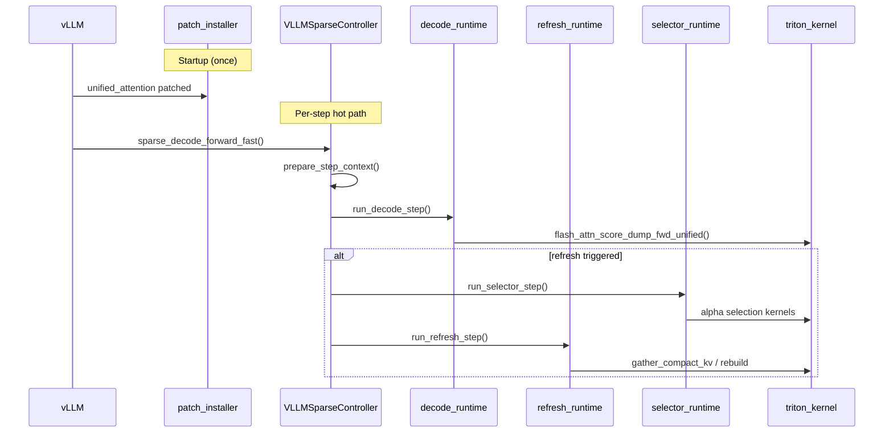

# patches/ Architecture

## Module Responsibility Map

### Core Modules (~9400 lines)

| Module | Lines | Responsibility |
|--------|-------|---------------|
| `vllm_sparse_patch.py` | ~4147 | Controller runtime: VLLMSparseController, lazy loaders, bridge methods, decode dispatch |
| `patch_installer.py` | ~1009 | Patch installation: monkey-patch vLLM internals, config deserialization, teardown |
| `layer_state.py` | ~963 | LayerState: per-layer mutable state (slot tracking, compact buffers, selection results) |
| `sparse_types.py` | ~846 | Pure data types: all dataclasses (StepMeta, StepContext, Config, etc.) |
| `persistent_batch.py` | ~433 | Persistent batch state across decode steps |
| `sparse_utils.py` | ~382 | Pure utility functions (alignment, tensor cache, C++ ext loader) |
| `step_authority.py` | ~281 | Step authority: step-level decision state and coordination |
| `sparse_constants.py` | ~245 | Environment-cached constants and feature flags |

### Infrastructure Modules (~990 lines)

| Module | Lines | Responsibility |
|--------|-------|---------------|
| `request_intent_ticket.py` | ~161 | RequestIntentTicket: per-request state transitions (threshold crossing, materialize) |
| `buffer_lease_protocol.py` | ~119 | Capture ring buffer lease/retire/reclaim protocol |
| `row_intent_protocol.py` | ~114 | Row-level intent protocol for dispatch decisions |
| `runtime_deps.py` | ~102 | `require_runtime_dep()` service locator for breaking circular imports |
| `buffer_allocator_backends.py` | ~99 | Buffer allocator backend implementations |
| `global_slot_allocator.py` | ~81 | Global slot allocation |
| `runtime_state.py` | ~77 | Runtime state management |
| `runtime_contracts.py` | ~73 | ExecutionBackendLedger and runtime contracts |
| `tp_contract.py` | ~70 | Tensor-parallel contract and collective guards |
| `step_cache.py` | ~57 | Step-level cache for decode fast path |
| `step_decode_pipeline.py` | ~54 | Step decode pipeline state application (apply_fast_plan_state, apply_full_runtime_state) |
| `sparse_cache.py` | ~43 | Shared empty tensor cache |
| `step_faults.py` | ~41 | Step fault detection and reporting |

### Sub-packages

| Package | Lines | Responsibility |
|---------|-------|---------------|
| `controller_mixins/` | ~5100 | 6 behavior mixins for VLLMSparseController (see below) |
| `refresh_runtime/` | ~5007 | Refresh step workers: kernel dispatch, flush, row state machine |
| `decode_runtime/` | ~4217 | Decode step workers: metadata builder, context, attention dispatch |
| `selector_runtime/` | ~1792 | Selector workers: batched selection, pipeline |

**Total: ~25,514 lines** (excluding `__init__.py` files)

## VLLMSparseController Mixin Decomposition

```
VLLMSparseController
  ├── SelectorComputeMixin  (~1843 lines) Token selection computation (alpha-fair, cross-head mutex)
  ├── RefreshRebuildMixin   (~1381 lines) Refresh/rebuild orchestration
  ├── WaitDeciderMixin      (~537 lines)  Refresh timing & wait decisions (interval, sentence triggers)
  ├── ProfileMixin          (~504 lines)  Performance profiling & timing (micro-profile ring)
  ├── CompactKVMixin        (~419 lines)  Compact KV cache slot management
  └── CaptureRingMixin      (~400 lines)  Capture ring buffer management (double-buffered)
```

## Worker Dependency Model

Workers use two import strategies to obtain dependencies:

### 1. Direct import (preferred)

Symbols imported from independent modules with no circular dependency risk:

```python
# Example: step_context_worker.py
from patches.step_decode_pipeline import apply_full_runtime_state
from patches.request_intent_ticket import mark_threshold_crossing
from triton_kernel.req_meta_flag_codec import validate_sink_tokens
```

### 2. require_runtime_dep (main-module symbols only)

Used only for symbols defined in `vllm_sparse_patch.py`, where direct import would create circular dependencies:

```python
# Example: unified_attention_worker.py
from patches.runtime_deps import require_runtime_dep
_execute_refresh_post_kernel = require_runtime_dep("_execute_refresh_post_kernel")
```

**Current require_runtime_dep usage** (13 symbols, distributed across 5 worker files):

| Worker | Calls | Symbols |
|--------|-------|---------|
| `kernel_dispatch.py` | 4 | `_prefill_update_key_norms`, `_get_global_decode_bound_layer`, `_get_global_prefill_req_meta`, `_build_layer_step_cache` |
| `unified_attention_worker.py` | 4 | `_execute_refresh_post_kernel`, `_prepare_prefill_capture_payload`, `_run_unified_attention_dispatcher`, `sparse_decode_forward_fast` |
| `meta_pack.py` | 3 | `_get_global_decode_req_meta`, `_get_global_prefill_req_meta`, `_get_cached_logits_patch_i32_stepwise_from_cache` |
| `post_kernel_worker.py` | 1 | `_prepare_refresh_capture_payload` |
| `payload_worker.py` | 1 | `_normalize_capture_layout_views` |
| `metadata_builder.py` | 1 | `_build_layer_step_cache` |

**Binding mechanism:** `_bind_runtime_worker_deps()` in the main module injects 13 symbols from `_RUNTIME_WORKER_DEP_NAMES` into the runtime_deps registry via `globals()`.

## Dependency Topology

```mermaid
graph TD
    subgraph "Data Layer (no business logic)"
        ST[sparse_types.py]
        SC[sparse_constants.py]
        SU[sparse_utils.py]
        SKC[sparse_cache.py]
    end

    subgraph "Infrastructure Layer"
        RD[runtime_deps.py]
        SDP[step_decode_pipeline.py]
        RIT[request_intent_ticket.py]
        RC[runtime_contracts.py]
        RS[runtime_state.py]
        BLP[buffer_lease_protocol.py]
        BAB[buffer_allocator_backends.py]
        GSA[global_slot_allocator.py]
        SA[step_authority.py]
        TC[tp_contract.py]
    end

    subgraph "State Layer"
        LS[layer_state.py]
        PB[persistent_batch.py]
    end

    subgraph "Mixin Layer (behavior, co-located state)"
        PM[ProfileMixin]
        CRM[CaptureRingMixin]
        CKM[CompactKVMixin]
        WDM[WaitDeciderMixin]
        RRM[RefreshRebuildMixin]
        SCM[SelectorComputeMixin]
    end

    subgraph "Controller Layer (orchestration)"
        VSP[vllm_sparse_patch.py]
    end

    subgraph "Runtime Workers"
        DR[decode_runtime/]
        RR[refresh_runtime/]
        SR[selector_runtime/]
    end

    subgraph "Startup (run once)"
        PI[patch_installer.py]
    end

    subgraph "Kernel Layer"
        TK[triton_kernel/]
        HS[hybrid_selectors/]
    end

    PI --> VSP
    VSP --> PM & CRM & CKM & WDM & RRM & SCM
    VSP --> LS & PB & ST & SC & SU
    VSP --> SDP & RIT & RC & RS & BLP & BAB & GSA & SA & TC
    VSP -.->|_bind_runtime_worker_deps| RD
    DR & RR & SR -->|direct import| TK & HS
    DR & RR & SR -->|direct import| ST & SC & SU & SDP & RIT
    DR & RR & SR -.->|require_runtime_dep| RD
    LS --> SC & SKC
    SCM --> SC & SU
    RRM --> CRM
    WDM --> RR
```



## Runtime Worker Internal Structure

### decode_runtime/ (~4217 lines)

| Module | Lines | Role |
|--------|-------|------|
| `metadata_builder.py` | 2042 | Build decode metadata, layer step cache |
| `step_context_worker.py` | 1188 | StepContext preparation, threshold crossing detection |
| `unified_attention_worker.py` | 408 | Hot-path entry: sparse_decode_forward_fast, prefill dispatch |
| `fast_executor.py` | 294 | Fast-path layer dispatch |
| `step_decode_data_worker.py` | 177 | StepDecodeData construction |
| `row_policy.py` | 35 | Row-level policy decisions |
| `entry.py` | 19 | `run_decode_step` entry point |
| `plan_builder.py` | 16 | Plan builder stub |
| `runtime.py` | 11 | Runtime state |
| `contracts.py` | 10 | Contract definitions |
| `fast_path_driver.py` | 6 | Fast path driver stub |

### refresh_runtime/ (~5007 lines)

| Module | Lines | Role |
|--------|-------|------|
| `kernel_dispatch.py` | 1711 | Unified attention dispatcher: prefill/decode kernel launch |
| `flush_worker.py` | 1092 | Async flush and compact KV rebuild |
| `meta_pack.py` | 897 | Dispatch metadata packing (decode/prefill/local plan) |
| `post_kernel_worker.py` | 472 | Post-kernel capture and refresh payload processing |
| `capture_layout_worker.py` | 397 | Step capture layout computation |
| `payload_worker.py` | 323 | Refresh payload preparation |
| `row_semantic.py` | 31 | Row semantic classification |
| `entry.py` | 30 | `run_refresh_step` entry point |
| `contracts.py` | 18 | Contract definitions |
| `flush_scheduler.py` | 8 | Flush scheduling utilities |
| `runtime.py` | 7 | Runtime state |
| `wait_decider.py` | 6 | Wait decider stub |

### selector_runtime/ (~1792 lines)

| Module | Lines | Role |
|--------|-------|------|
| `selection_worker.py` | 905 | Alpha-fair selection, cross-head mutex |
| `batched_selection.py` | 823 | Batched token selection pipeline |
| `entry.py` | 22 | `run_selector_step` entry point |
| `contracts.py` | 10 | Contract definitions |
| `runtime.py` | 7 | Runtime state |
| `buffer_gate.py` | 6 | Buffer gate stub |
| `pipeline.py` | 6 | Pipeline stub |

## Data Flow: Request Lifecycle



## File Navigation Guide

**To understand runtime behavior:** Start with `vllm_sparse_patch.py` docstring, then `sparse_decode_forward_fast()`.

**To modify data structures:** Edit `sparse_types.py` (all dataclasses) or `layer_state.py` (LayerState).

**To modify token selection:** Look at `controller_mixins/selector_compute_mixin.py` and `selector_runtime/`.

**To modify refresh logic:** Look at `controller_mixins/refresh_rebuild_mixin.py` and `refresh_runtime/`.

**To modify decode dispatch:** Look at `decode_runtime/` workers.

**To modify patch installation:** Edit `patch_installer.py`.

**To add a new mixin:** Create a file in `controller_mixins/`, add it to `__init__.py`, then add it to the class inheritance chain and `__init__` call in `vllm_sparse_patch.py`.

**To migrate a `require_runtime_dep` call:** Replace with a direct import if the symbol is defined in an independent module (not `vllm_sparse_patch.py`). Only symbols defined in the main file need the service locator pattern.
